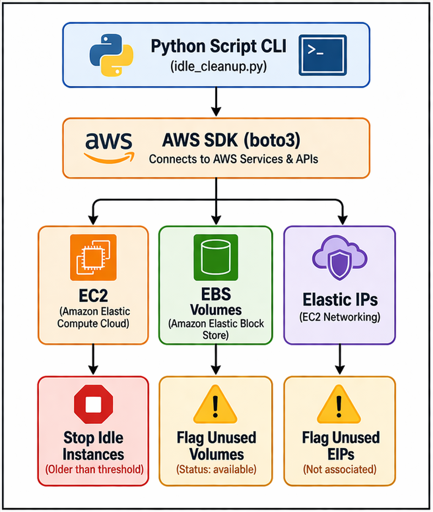

# Python Automation - Idle Cloud Resource Cleanup

This script identifies and cleans up unused AWS resources to reduce cloud costs

### Features:
- Stops idle EC2 instances older than X days
- Detects unattached EBS volumes
- Identifies unused Elastic IPs

### Usage:

python idle_resource_cleanup.py

### Requirements:

- AWS CLI configured
- IAM permissions:
-   ec2:DescribeInstances
-   ec2:StopInstances
-   ec2:DescribeVolumes
-   ec2:DescribeAddresses

### Architecture Diagram

